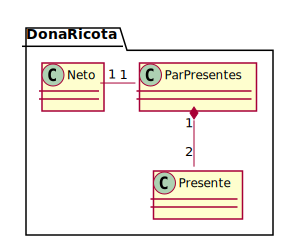

# presentes-de-natal
Dona Ricota é uma senhora muito meticulosa. Como o natal está se aproximando ela quer distribuir pares de presentes para seus familiares.

Durante sua última viagem, Dona Ricota comprou 2n presentes para seus n netos. Cada presente custou xi reais (1 ≤ i ≤ 2n) e, para evitar conflitos, ela planeja formar os pares de presentes de modo a minimizar a diferença entre o valor total do par de presentes mais caro e o valor total do par mais barato.

Como você é uma pessoa gentil, Dona Ricota resolveu pedir sua ajuda para organizar os presentes.

## Domain model
